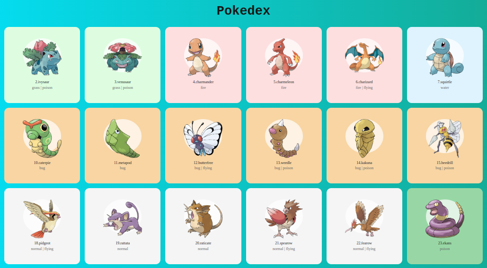

<h1 align="center"> API Pokemon <h1>
<h1 align="center" >

</h1>

<h1 align="center">
</h1>

 A aplicação **API Pokemon** é uma mini enciclopédia de Pokémon. Ela mostra informações sobre os 150 primeiros Pokémon usando imagens, nomes e tipos. A informação é buscada da PokeAPI usando JavaScript. Cada Pokémon é exibido em um cartão colorido, que representa seu tipo. É uma introdução ao desenvolvimento web, apresentando dados de forma atraente para os fãs de Pokémon.
  
   

 

